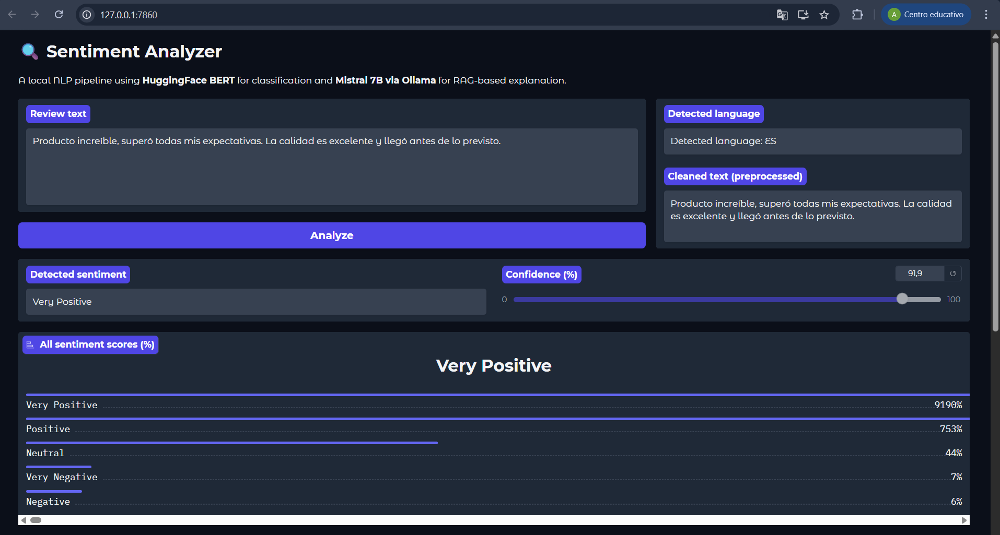
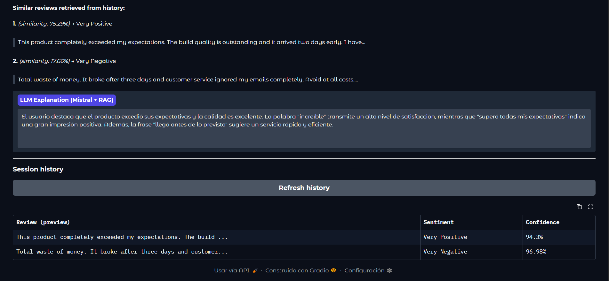
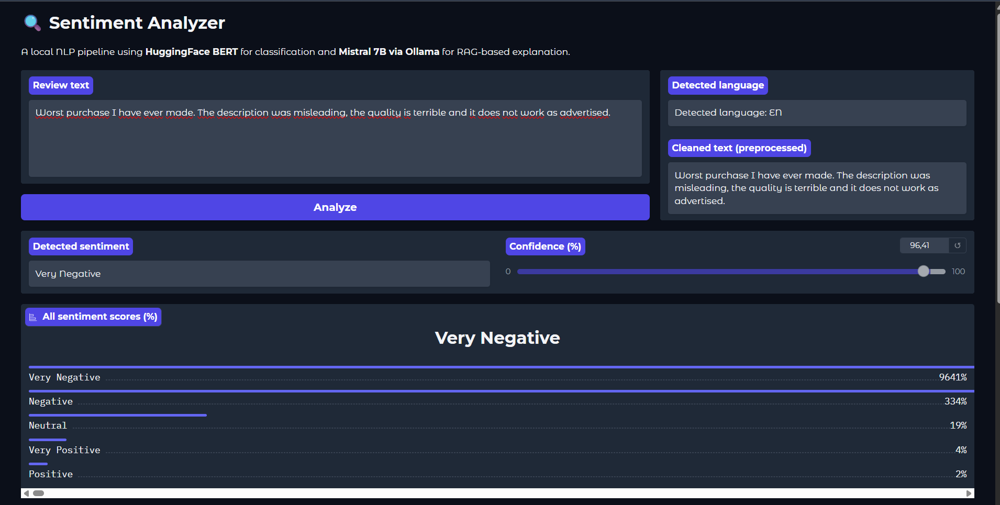
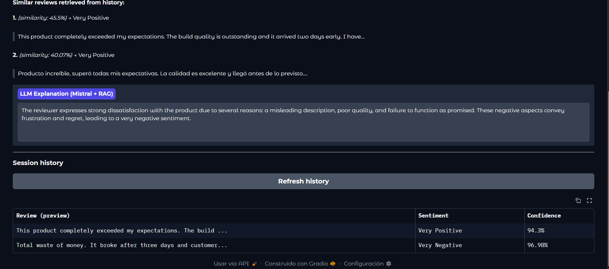
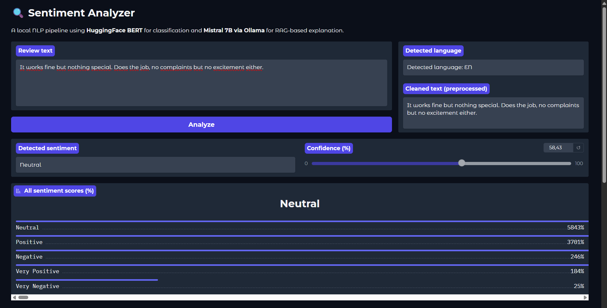
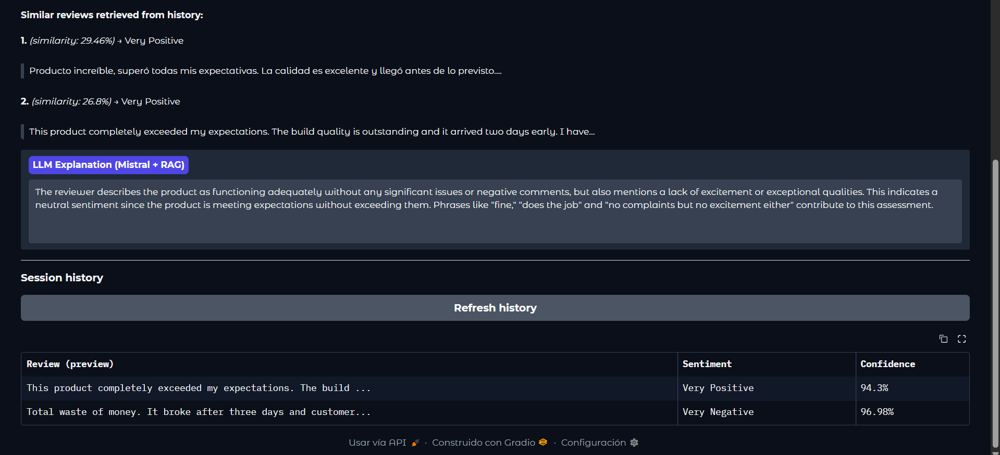
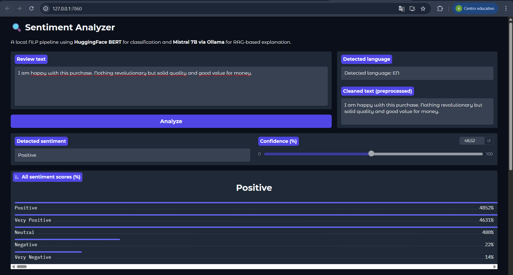
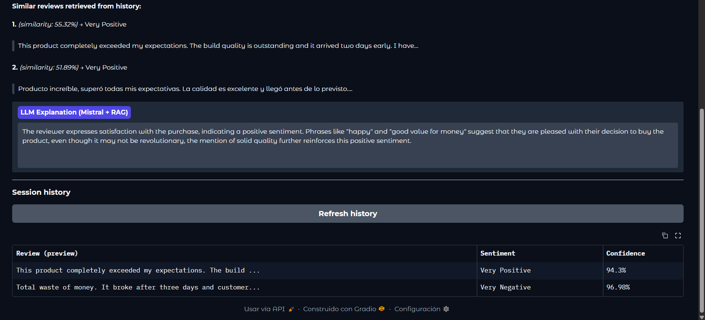
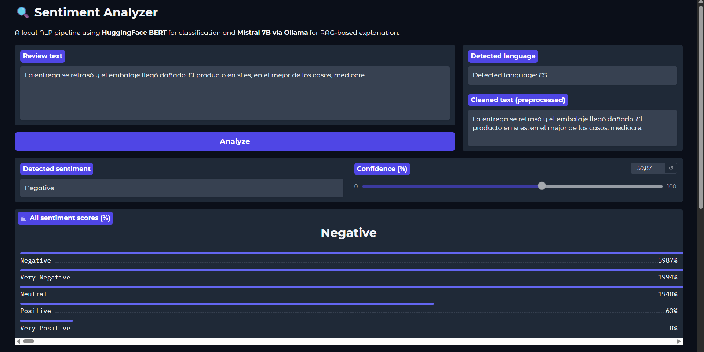
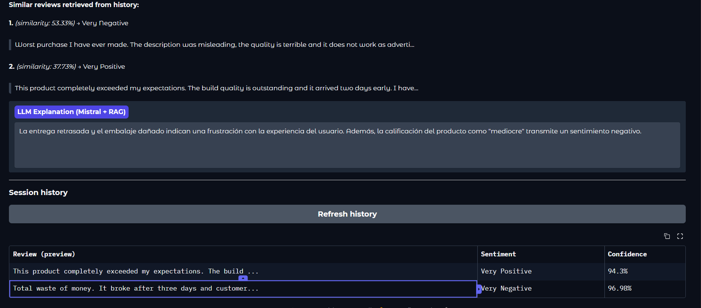

# Sentiment Analyzer — Technical Report
### A Local NLP Pipeline with RAG-Based Explanation

**Course:** Natural Language Processing  
**Author:** Alex Caride Cid  

## 1. Problem Description
In the beginning I started thinking about what problem to solve for this project. I thought of sentiment analysis tools but they tell you what the sentiment is and they never explain why. I also thought that if a user gets a "Very Negative" label they don't know what triggered it. So I decided to change this problem to make a system that reads a review and explains its reasoning. 

I also wanted it to work in English and Spanish because I use both of them and I thought it would be a good challenge.

## 2. System Design and Workflow
I designed the system in five steps. In the beginning I thought of writing a single script but I decided to split the code into six independent modules because it makes it easier to test. 

The first thing I did was clean the input. I remove URLs and special characters and I detect the language automatically. Then I built the classifier just how it was shown on HuggingFace and pass the clean text to a multilingual BERT model. It outputs the probability for five levels. I looked it up and I choose to use confidence scores for all categories because it's more informative. 

After this I convert the review into an embedding vector to capture the meaning. Then I used cosine similarity to retrieve the two most similar past reviews. With this I build a prompt for Mistral 7B. I did this because we want the model to use the RAG component. I chose to put the temperature very low (0.3) because otherwise it was too creative. Finally I add the review to the memory.

## 3. Model Selection and Justification
In this case I searched online to choose the models because it affects the quality and if my laptop can run it. 

For the sentiment I found out about `nlptown/bert-base-multilingual-uncased-sentiment` and I tried it. I used this because it is fine-tuned on product reviews. I didn't use a generative LLM because classifiers are faster. 

For embeddings I used `paraphrase-multilingual-MiniLM-L12-v2`. I tried other alternatives but this one worked correctly and it handles English and Spanish well. 

For the LLM I chose Mistral 7B using Ollama. I thought of using LLaMA-70B but it´s so big of a model that my laptop couldn´t run it. I also tried OPT-125M but it didn´t work very well because it couldn´t produce good explanations. Mistral 7B finally worked and it didn't take too long.

## 4. Implementation Details
I built the project using Python and libraries like transformers, scikit-learn and gradio. 

In this case I also used lazy model loading. I did this because otherwise it was taking too long to start. The model only loads when I use it. For the vector store I built a simple in-memory store using numpy arrays because using ChromaDB was taking too much configuration. 

The program failed several times with the prompt, but I fixed it and finally it worked. One example of this error happened because I didn´t put the right examples. Then I used two fixed examples to establish the format and then the retrieved reviews. For the interface I used Gradio Blocks because I wanted to show all the steps with pictures.

## 5. Results, Limitations and Possible Improvements
I tested it with English and Spanish reviews and it worked well. As you can see the RAG component makes the explanations much better after you put five or six reviews. 

But it didn´t work very well for everything because I think there are some limitations. The biggest problem is that the memory is deleted when you restart the app. The program also failed sometimes because the BERT model truncates at 512 characters, so if the review is too long it couldn't perform well at all. 

As I said I think I would need to change the memory to ChromaDB so the data is not lost. I also think I would add a confidence threshold so it doesn´t give a bad label if it's not sure. Now I would paste pictures of the interface with their results:

## 6. Screenshots

### Very Positive review

### Very Negative review

### Neutral review

### Positive review

### Negative review

